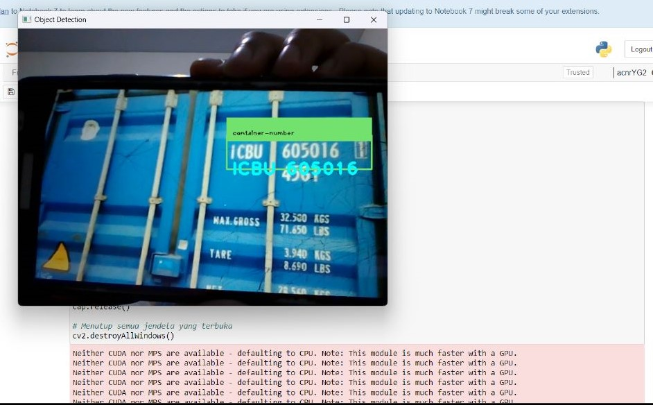
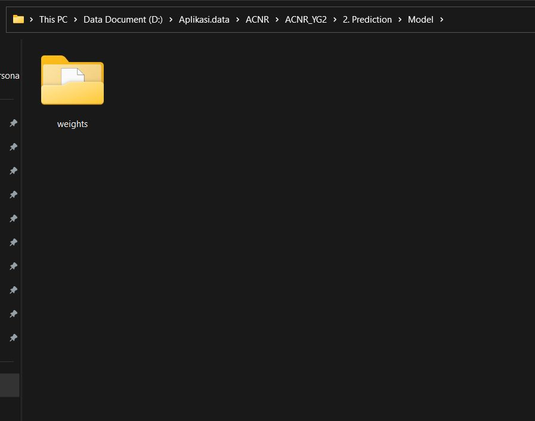

# ACNR-Automatic-Container-Number-Recognition-
ACNR merupakan sistem yang dapat melakukan detection dan recognition pada nomor box kendaraan kontainer. Sistem ini diciptakan dengan menggunakan YOLO v5 dan easyocr untuk ekstraksi teks dari gambar dan secara real time. 



:loudspeaker: **Program ini dibuat dengan menggunakan python version 3.8 pada operating system windows serta dijalankan pada jupyter notebook**

## Langkah Menjalankan Program
1. Buat folder baru

2. Clone repo ini : https://github.com/Yundapuji/ACNR-Automatic-Container-Number-Recognition-

3. Buat folder 'Model' di dalam folder 2. Prediction

4. Di dalam folder Model download folder weights : https://drive.google.com/drive/folders/1-ch3crLhyg2mKRWh7zl17bUHvE-IvV_z?usp=sharing 
   

5. Membuat virtual environment dan activate environment tersebut
    - Masuk di path folder yang telah dibuat
    - ```pip install vitualenv ```
    - Buka powershell di cmd 
    - ```virtualenv -p 'path dari python.exe yang akan digunakan' nama_virtual_environment```
    - Keluar dari powershell 
    - Activate virtual environment
      ```.\nama_virtual_environment\Scripts\activate```
      
6. Download dependensi yang di perlukan dan menambahkan virtual environment di python kernel jupyter notebook
    - ```pip install -r requirements.txt```
    - ```python -m ipykernel install --user --name=nama_virtual_environment```
    
7. Masuk di path folder 2. Prediction ```cd 2. Prediction``` dan membuka jupyter notebook
    - ```jupyter notebook```

8. Buka Notebook [00. Predictions.ipynb](URL"https://github.com/Yundapuji/ACNR-Automatic-Container-Number-Recognition-/blob/3710947336d71ac270e2b686f89a264fab6eb4f5/2.%20Prediction/00.%20Predictions.ipynb")

9. Ganti kernel dengan nama_virtual_environment yang dibuat sebelumnya --> Kernel --> Change kernel
   

10. Untuk file input yang akan dideteksi dapat dipilih pada folder [TestModel](URL"https://github.com/Yundapuji/ACNR-Automatic-Container-Number-Recognition-/tree/3710947336d71ac270e2b686f89a264fab6eb4f5/2.%20Prediction/TestModel")


⚠️ **Penting:** Jika melakukan deteksi pada gambar, program ini dapat melakukan deteksi pada gambar dengan size dibawah 1920 X 1080. Gambar diatas size tersebut akan otomatis di crop. 
     


